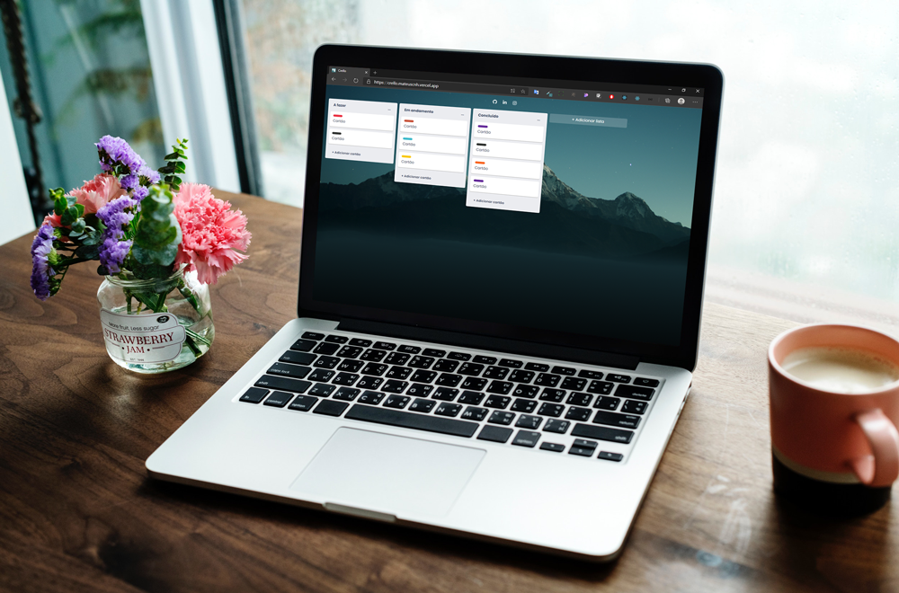

  
   
  <a href="https://crello.mateuscnh.vercel.app/">Vercel deploy</a>

  

 

## 💻 Project

A clone version of Trello... 'Crello' :smile:. Developmented to practice ReactJS with Styled-Components and more...

 

## 🚀 Technologies

- ReactJS
- Styled Components
- React DnD (Drag and Drop for React)
- JSON Server (deploy in Heroku)
 

 
